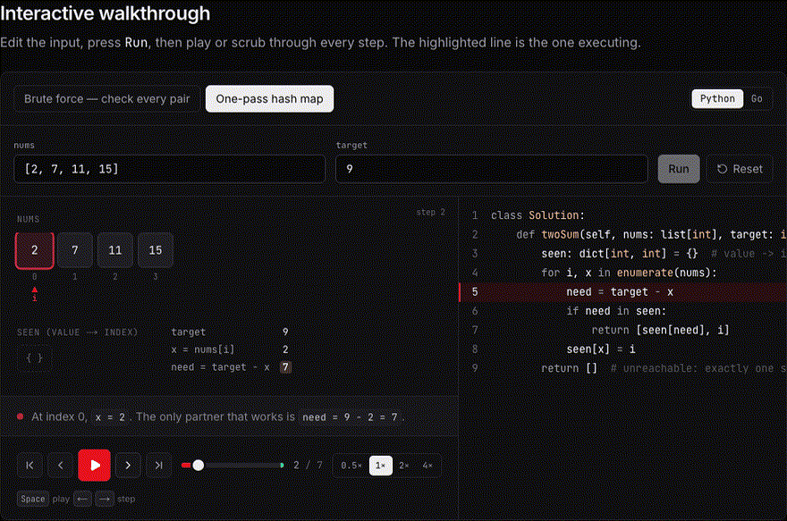
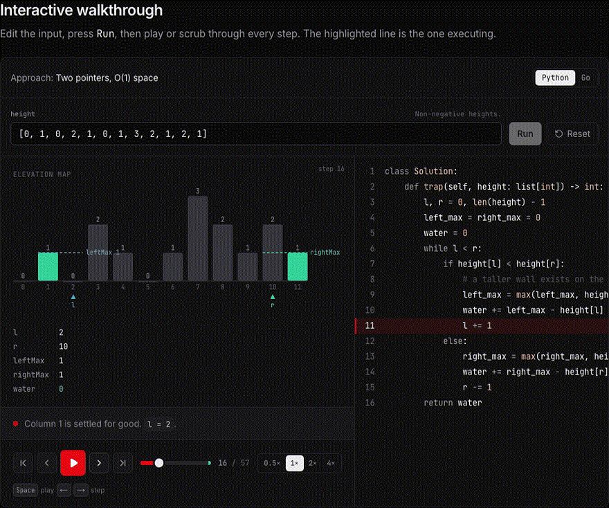
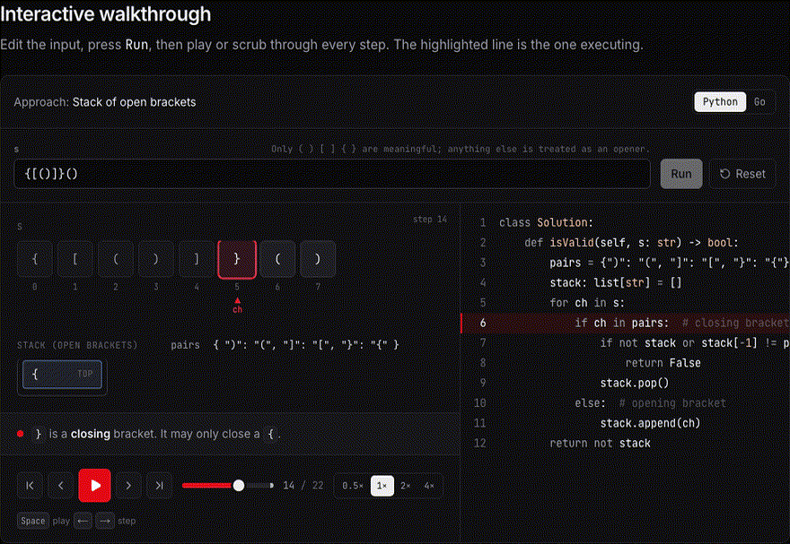
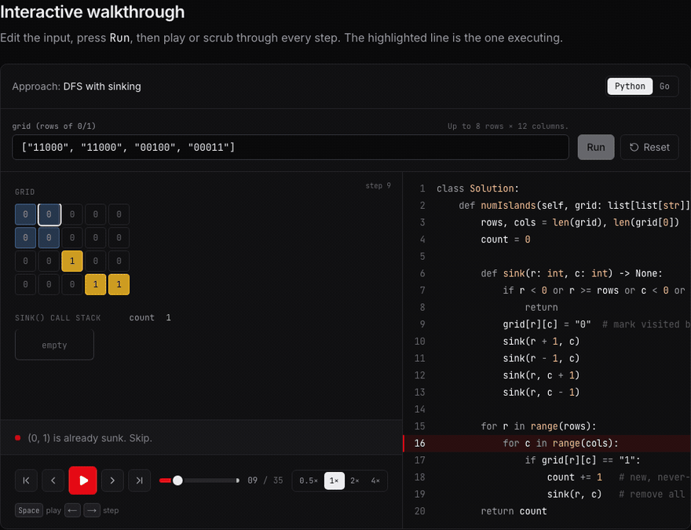
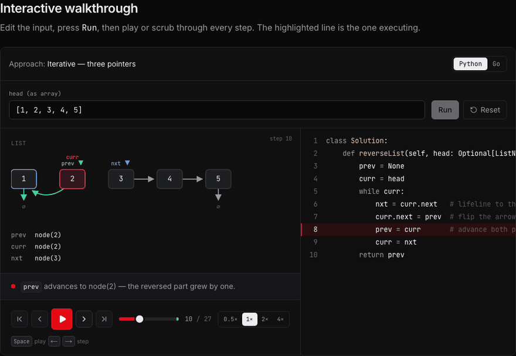
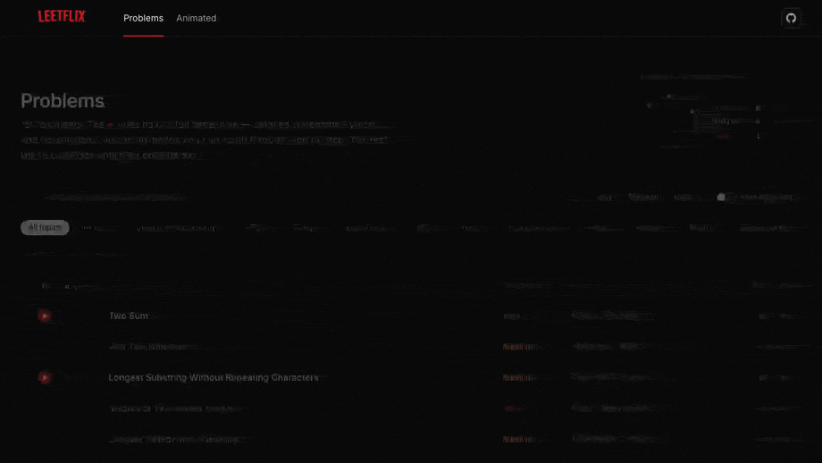

<div align="center">


<br/>

[](https://jasodeep.github.io/leetflix/)

**LeetCode solutions · algorithm visualizations · coding interview prep**

Pick a problem. Read a short explanation. Play the animation. Switch between Python and Go.

**4,060** LeetCode problems indexed · **3,276** free ones you can play · **Python + Go** on every free page

[](https://jasodeep.github.io/leetflix/) [](https://github.com/jasodeep/leetflix/actions/workflows/ci.yml) [](LICENSE) [](https://jasodeep.github.io/leetflix/) [](https://jasodeep.github.io/leetflix/) [](https://github.com/jasodeep/leetflix/stargazers)

</div>

---

## What you get

1. **A list of every LeetCode problem** — search, filter by Easy / Medium / Hard, type, or method.
2. **A solution page** — the idea in plain language, then Python and Go.
3. **An animation** — play, pause, and step through the algorithm. Change the input and run it again.

Free problems are playable here. Locked / premium problems send you to LeetCode.

---

## Watch a solution

Each animation is the algorithm, not a slideshow. The red line follows the current step.

<p align="center">
  <a href="https://jasodeep.github.io/leetflix/problems/two-sum/">
    
  </a>
  <br/>
  <sup><a href="https://jasodeep.github.io/leetflix/problems/two-sum/">1. Two Sum</a> — one-pass hash map · O(n) · Python and Go</sup>
</p>

<p align="center">
  <a href="https://jasodeep.github.io/leetflix/problems/trapping-rain-water/">
    
  </a>
  &nbsp;
  <a href="https://jasodeep.github.io/leetflix/problems/valid-parentheses/">
    
  </a>
  <br/>
  <sup>
    <a href="https://jasodeep.github.io/leetflix/problems/trapping-rain-water/">42. Trapping Rain Water</a>
    &nbsp;·&nbsp;
    <a href="https://jasodeep.github.io/leetflix/problems/valid-parentheses/">20. Valid Parentheses</a>
  </sup>
</p>

<p align="center">
  <a href="https://jasodeep.github.io/leetflix/problems/number-of-islands/">
    
  </a>
  &nbsp;
  <a href="https://jasodeep.github.io/leetflix/problems/reverse-linked-list/">
    
  </a>
  <br/>
  <sup>
    <a href="https://jasodeep.github.io/leetflix/problems/number-of-islands/">200. Number of Islands</a>
    &nbsp;·&nbsp;
    <a href="https://jasodeep.github.io/leetflix/problems/reverse-linked-list/">206. Reverse Linked List</a>
  </sup>
</p>

| Key        | What it does                     |
| :--------- | :------------------------------- |
| Space      | Play or pause                    |
| ← →        | Step backward or forward         |
| Home / End | Jump to the first or last step   |
| /          | Focus search on the problem list |
| J / K      | Move down or up the list         |

---

## Browse the catalogue

The home page is a table, like LeetCode. Filters stay in the URL, so you can share a view.

<p align="center">
  <a href="https://jasodeep.github.io/leetflix/">
    
  </a>
</p>

Every problem page has three parts:

| Section         | What you see                                                               |
| :-------------- | :------------------------------------------------------------------------- |
| **Problem**     | Statement, constraints, and examples                                       |
| **Solution**    | Why it works, then Python and Go (tabs if there is more than one approach) |
| **Walkthrough** | The interactive animation — edit the input and press Run                   |

---

## Run it on your machine

<a id="run-it-on-your-machine"></a>

You need **Node 20.19+**. No Docker, no `.env`, no API key.

```bash
git clone https://github.com/jasodeep/leetflix.git
cd leetflix
npm install
npm run dev
```

Open [http://localhost:3000](http://localhost:3000).

| Command         | What it does                                    |
| :-------------- | :---------------------------------------------- |
| `npm run dev`   | Local site with live reload                     |
| `npm test`      | Unit tests                                      |
| `npm run check` | Lint, types, tests, and formatting — same as CI |
| `npm run build` | Static site in `out/`                           |
| `npm start`     | Serve that export                               |

To match GitHub Pages locally:

```bash
NEXT_PUBLIC_SITE_URL=https://jasodeep.github.io/leetflix \
NEXT_PUBLIC_BASE_PATH=/leetflix \
npm run build && npm start
```

---

## Project

| Doc                                   | What it is                               |
| :------------------------------------ | :--------------------------------------- |
| [Contributing](CONTRIBUTING.md)       | Setup, `npm run check`, adding a problem |
| [Architecture](docs/ARCHITECTURE.md)  | Static export, catalogue resolution, CI  |
| [Changelog](CHANGELOG.md)             | User-visible changes                     |
| [Security](SECURITY.md)               | How to report a vulnerability            |
| [Code of conduct](CODE_OF_CONDUCT.md) | How we work together                     |

---

<details>
<summary>Add a problem (for contributors)</summary>

<br/>

1. Make sure the row exists in the catalogue (it usually already does).
2. Add `src/content/problems/<slug>.ts` with Python and Go.
3. Add a trace in `src/content/traces/<slug>.ts` for each animated approach.
4. Register both files in their `index.ts`.
5. Run `npm test`.

A **trace** records `{ marker, note, panels }` after each step. A missing marker fails the build.

</details>

<details>
<summary>How the site is published</summary>

<br/>

Push to `main` runs [pages.yml](.github/workflows/pages.yml). After checks pass, the static `out/` folder is pushed to the `release` branch.

In the repo: **Settings → Pages → Deploy from a branch → `release` / (root)**.

Live site: **https://jasodeep.github.io/leetflix/**

</details>

---

<div align="center">


<br/>

Parody project. Not affiliated with Netflix or LeetCode.  
Problem statements belong to their owners.

[**Open Leetflix →**](https://jasodeep.github.io/leetflix/)


</div>
